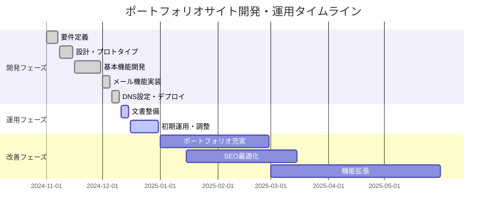

# プロジェクトタイムライン

## プロジェクト基本情報

**プロジェクト名**: 井原誠斗 ポートフォリオサイト  
**期間**: 2024年12月 〜 継続中  
**フェーズ**: 運用・改善段階  

## プロジェクト全体スケジュール

### フェーズ概要

## 詳細タイムライン

### 【完了】Phase 1: 基盤構築期（2024年11月）

#### Week 1: 要件定義・企画（11/1-11/7）
- [x] プロジェクト目標の明確化
- [x] ターゲットユーザーの定義
- [x] 機能要件の洗い出し
- [x] 技術スタックの決定
- [x] プロジェクト全体スケジュールの策定

**成果物**
- プロジェクト企画書
- 技術選定資料
- 初期スケジュール

#### Week 2: 設計・プロトタイプ（11/8-11/15）
- [x] サイト構造の設計
- [x] UI/UXワイヤーフレーム作成
- [x] デザインシステムの構築
- [x] 技術アーキテクチャの設計
- [x] 開発環境のセットアップ

**成果物**
- ワイヤーフレーム
- デザインスタイルガイド
- 技術アーキテクチャ図
- 開発環境

### 【完了】Phase 2: 開発期（2024年11月下旬-12月上旬）

#### Week 3-4: 基本機能開発（11/16-11/30）
- [x] Next.js + React + TypeScript基盤構築
- [x] レスポンシブデザイン実装
- [x] ヘッダー・ナビゲーション実装
- [x] ヒーロー・Aboutセクション実装
- [x] Services・Skillsセクション実装
- [x] Portfolio・Contactセクション実装

**成果物**
- ホームページの基本構造
- 全セクションの実装
- レスポンシブ対応

#### Week 5: メール機能・仕上げ（12/1-12/5）
- [x] お問い合わせフォーム実装
- [x] Resend API連携
- [x] メール送信機能テスト
- [x] バリデーション・エラーハンドリング
- [x] 最終調整・テスト

**成果物**
- 完全に動作するお問い合わせフォーム
- メール送信システム

#### Week 6: デプロイ・公開（12/6-12/10）
- [x] ドメイン取得（ihara-frontend.com）
- [x] Vercelデプロイ設定
- [x] DNS設定（MX、SPF、DKIM）
- [x] SSL証明書設定
- [x] 本番環境テスト

**成果物**
- 本番環境での稼働開始
- ドメイン・DNS設定完了

### 【進行中】Phase 3: 運用開始期（2024年12月中旬）

#### Week 7: 文書整備・品質向上（12/11-12/15）
- [x] プロジェクト文書の整備
  - [x] overview.md（プロジェクト概要）
  - [x] requirements.md（要件定義書）
  - [x] tech-specs.md（技術仕様書）
  - [x] user-structure.md（ユーザー構造）
  - [x] timeline.md（本文書）
- [ ] コードレビュー・リファクタリング
- [ ] パフォーマンス最適化
- [ ] SEO基本設定

**成果物**
- 完全な文書セット
- 最適化されたコードベース

#### Week 8: 初期運用（12/16-12/22）
- [ ] Google Analytics導入
- [ ] Search Console設定
- [ ] 初期アクセス解析
- [ ] 問い合わせ対応フローの確立

#### Week 9-10: 調整・改善（12/23-12/31）
- [ ] 年末年始対応
- [ ] 初期フィードバックの収集
- [ ] 軽微な修正・改善
- [ ] 次フェーズの計画策定

### 【予定】Phase 4: コンテンツ充実期（2025年1-2月）

#### 2025年1月: ポートフォリオ強化
- [ ] 実績事例の整理・準備
- [ ] プロジェクト詳細ページ作成
- [ ] ケーススタディの執筆
- [ ] 画像・動画素材の準備

**目標成果物**
- 3-5件の詳細な実績事例
- プロジェクト紹介ページ
- お客様の声・推薦文

#### 2025年2月: ブログ・記事コンテンツ
- [ ] 技術ブログ機能の検討
- [ ] AI×Web開発に関する記事執筆
- [ ] FAQ・よくある質問の作成
- [ ] 技術解説コンテンツの作成

**目標成果物**
- 10本以上の技術記事
- 充実したFAQセクション
- 専門性をアピールするコンテンツ

### 【予定】Phase 5: 機能拡張期（2025年3-5月）

#### 2025年3月: SEO・集客強化
- [ ] SEO徹底最適化
- [ ] 構造化データ実装
- [ ] サイトマップ最適化
- [ ] 外部リンク獲得戦略

#### 2025年4月: 機能追加
- [ ] お客様の声セクション追加
- [ ] 価格表・パッケージ紹介
- [ ] オンライン相談予約機能検討
- [ ] 多言語対応の検討

#### 2025年5月: AI統合デモ
- [ ] AI機能のデモ実装
- [ ] チャットボット機能
- [ ] AI活用事例の紹介
- [ ] 技術的差別化の強化

### 【継続】Phase 6: 継続運用・改善（2025年6月以降）

#### 継続的な改善活動
- [ ] 月次アクセス解析レポート
- [ ] ユーザーフィードバックの収集・反映
- [ ] 技術スタックのアップデート
- [ ] セキュリティ監査・対策

#### ビジネス成長対応
- [ ] 事業拡大に伴うサイト拡張
- [ ] パートナーシップページ
- [ ] 採用情報ページ（将来的）
- [ ] 企業向け専用セクション

## マイルストーン

### 主要マイルストーン

| 日付 | マイルストーン | 達成状況 |
|------|---------------|----------|
| 2024/11/07 | 要件定義完了 | ✅ 完了 |
| 2024/11/15 | 設計・プロトタイプ完了 | ✅ 完了 |
| 2024/11/30 | 基本機能開発完了 | ✅ 完了 |
| 2024/12/05 | メール機能実装完了 | ✅ 完了 |
| 2024/12/10 | サイト公開 | ✅ 完了 |
| 2024/12/15 | 文書整備完了 | 🔄 進行中 |
| 2024/12/31 | 初期運用期間完了 | ⏳ 予定 |
| 2025/02/28 | ポートフォリオ充実完了 | ⏳ 予定 |
| 2025/05/31 | 機能拡張期完了 | ⏳ 予定 |

### KPI目標タイムライン

#### 2024年12月（運用開始月）
- **目標**: サイト安定稼働、初期データ収集
- **訪問者数**: 50人/月
- **問い合わせ**: 1-2件/月
- **主要施策**: 基本的なSEO設定、初期プロモーション

#### 2025年1-3月（成長期）
- **目標**: 認知度向上、問い合わせ増加
- **訪問者数**: 200人/月
- **問い合わせ**: 3-5件/月
- **主要施策**: コンテンツ充実、SEO強化

#### 2025年4-6月（安定期）
- **目標**: 安定した集客、質の高い問い合わせ
- **訪問者数**: 500人/月
- **問い合わせ**: 5-8件/月
- **主要施策**: 機能拡張、差別化強化

#### 2025年7月以降（拡張期）
- **目標**: 事業成長支援、新サービス展開
- **訪問者数**: 1000人/月
- **問い合わせ**: 10件以上/月
- **主要施策**: 新機能開発、パートナーシップ構築

## リスク管理・緊急時対応

### 技術的リスク
- **サーバーダウン**: Vercelの安定性に依存、監視体制構築
- **セキュリティ問題**: 定期的な脆弱性チェック、アップデート
- **パフォーマンス低下**: 継続的な最適化、監視

### ビジネスリスク
- **競合増加**: 差別化強化、技術的優位性の維持
- **市場変化**: トレンド把握、柔軟な戦略変更
- **集客不足**: マーケティング戦略の見直し

### 対応策
- **バックアップ計画**: コード・データの定期バックアップ
- **緊急時連絡**: 問題発生時の迅速な対応体制
- **代替手段**: メール機能停止時の代替連絡手段

## 成功指標の評価タイミング

### 週次レビュー（毎週金曜日）
- アクセス状況の確認
- 問い合わせ状況の確認
- 技術的問題の確認

### 月次レビュー（月末）
- KPI達成状況の評価
- ユーザーフィードバックの分析
- 次月の施策検討

### 四半期レビュー（3月、6月、9月、12月）
- 戦略的目標の評価
- 大幅な改善計画の策定
- 技術スタックの見直し

このタイムラインに基づいて、計画的にプロジェクトを進め、継続的な改善を通じて最高品質のポートフォリオサイトを運営していきます。
